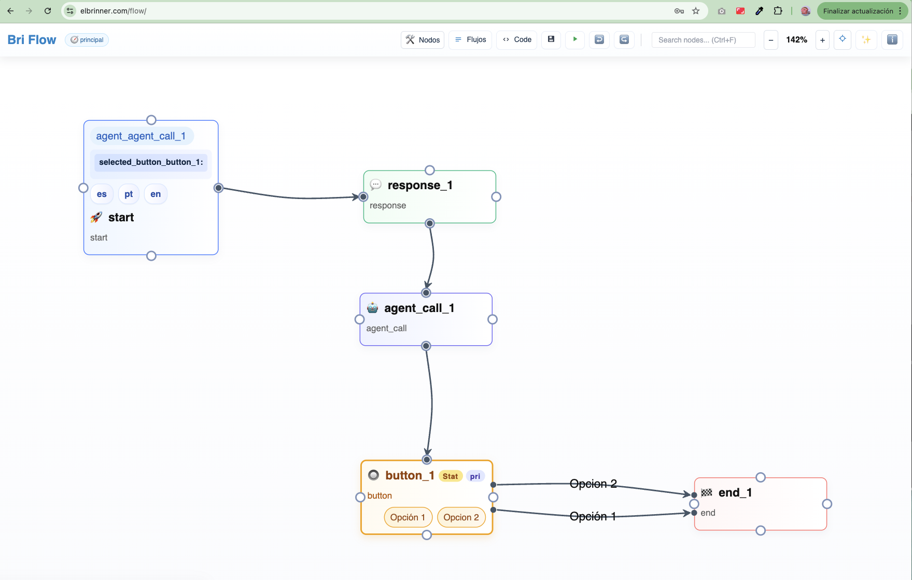

# BRI-FLOW



Editor visual (frontend) para diseñar flujos conversacionales/procesos mediante nodos conectables. El resultado es un JSON estructurado que describe el flujo.

Este repositorio contiene el **editor** y utilidades de **simulación** en navegador.

Nota: para **usar/ejecutar** estos flujos en un sistema real necesitas construir un **backend/runtime** que interprete el JSON exportado. Ese componente no está incluido aquí.

## Demo

- Online: https://elbrinner.com/flow/

## Ejecutar en local

Recomendado (servidor estático):

1. `python3 -m http.server 8081`
2. Abrir `http://localhost:8081`

Alternativa (Node.js):

1. `npx http-server -p 8081`
2. Abrir `http://localhost:8081`

Alternativa rápida: abrir `index.html` (limitado por políticas del navegador si vas a hacer llamadas HTTP).

## Documentación

- Índice: [docs/README.md](docs/README.md)
- Nodos: [docs/nodos.md](docs/nodos.md) (compat: [docs/nodo.md](docs/nodo.md))
- Expresiones: [docs/expresiones.md](docs/expresiones.md)
- Desarrollo: [docs/desarrollo.md](docs/desarrollo.md)
- Pruebas: [docs/pruebas.md](docs/pruebas.md)

---

## Nodos (tipos soportados)

Un nodo es un objeto con campos comunes como:

- `id`, `type`, `x`, `y`
- `next`: destino (por defecto `{ flow_id: "", node_id: "..." }` o `null`)
- `descripcion`: texto libre
- `i18n`: en nodos de UI (por idioma)

### Resumen por tipo

| Tipo | Para qué sirve | Campos típicos |
|---|---|---|
| `start` | Inicio del flujo (único por flujo) | `variables[]`, `locales[]`, `enable_debug` |
| `end` | Fin del flujo | (sin campos extra; `next` debe ser `null`) |
| `response` | Mensaje al usuario (texto) | `i18n[loc].text[]`, `next` |
| `hidden_response` | Mensaje no visible / dataInfo | `dataInfo`, `next` |
| `input` | Pregunta y captura una variable | `i18n[loc].prompt`, `save_as`, `next` |
| `choice` | Elección (modo prompt o switch) | `mode: "prompt"|"switch"`, `options[]` o `cases[]`, `default_target` |
| `button` | Botones (1 selección) | `options[]`, `mode`, `provider.*`, `optional`, `variant` |
| `multi_button` | Botones (multi selección) | `options[]`, `mode`, `provider.*`, `optional`, `variant` |
| `hero_card` | Tarjeta (hero) | `title`, `subtitle`, `text`, `image_url`, `buttons[]` |
| `carousel` | Carrusel de tarjetas | `cards[]` |
| `adaptive_card` | Tarjeta adaptativa (payload) | (varía; ver docs) |
| `form` | Formulario (estático o dinámico) | `mode`, `fields[]` o `fields_source`, `save_as`, `filter_expr`, `sort_expr` |
| `assign_var` | Asignar variables | `assignments[]` (o `target`/`value`) |
| `condition` | Bifurcación true/false | `expr`, `true_target`, `false_target` |
| `loop` | Loop (foreach/while) | `mode`, `source_list`, `item_var`, `index_var`, `cond`, `body_start`, `after_loop` |
| `foreach` | Alias compatible de loop | (se normaliza como `loop`) |
| `rest_call` | Llamada HTTP REST | `method`, `url`, `headers`, `mappings[]`, `save_as`, `save_path` |
| `file_upload` | Subir archivo (UI) | `accept`, `max_size`, `save_as` |
| `file_download` | Descargar archivo | `file_url`, `filename`, `description` |
| `json_export` | Exportar JSON | `filename`, `description`, `template` |
| `set_goto` | Ir a un nodo por id | `target` |
| `flow_jump` | Saltar a otro flujo/nodo (y opcional retorno) | `target`, `return_on_end`, `return_target`, `apply_start_defaults` |
| `event_start` | Inicio por evento | `event_type`, `filter_expr` |
| `human_validation` | Validación humana | `timeout`, `approvers[]`, `on_timeout` |
| `debug` | Depuración (simulador) | (varía; ver UI) |
| `agent_call` | Llamada a agente (simulador) | (ver UI; depende de perfil) |
| `credential_profile` | Perfil de credenciales (sim-only) | (no se exporta al flujo final) |
| `use_profile` | Activar perfil (sim-only) | `profile` |
| `extra` | Nodo auxiliar minimalista | `next`, `descripcion` |
| `coordinator` | Coordinador/orquestación (experimental) | `strategy`, `sub_agents[]`, `aggregation` |

Notas:

- `choice_switch` existe como “atajo de UI”, pero se crea como `choice` con `mode: "switch"`.
- La documentación completa de campos por nodo vive en [docs/nodos.md](docs/nodos.md).

---

## Expresiones

El editor/simulador evalúa expresiones con el parser del navegador (`window.ExpressionParser`). Se usan típicamente en:

- `condition.expr`
- `loop.cond` / selectores y filtros (`filter_expr`, `sort_expr`)
- asignaciones (`assign_var`)
- casos del `choice` en modo switch (`cases[].when`)

### Variables y rutas

- Variables: `miVariable`
- Rutas con punto: `user.name`, `order.total`
- Literales: números (`10`, `3.14`), strings (`"hola"`, `'hola'`), booleanos (`true/false`), `null`, `undefined`

### Operadores

- Unarios: `+x`, `-x`, `!x`
- Aritméticos: `+`, `-`, `*`, `/`, `%`
- Comparación: `<`, `<=`, `>`, `>=`
- Igualdad: `==`, `!=`, `===`, `!==`
- Lógicos: `&&`, `||`
- Ternario: `cond ? a : b`

### Funciones disponibles (resumen)

Texto / utilidades:

- `len(x)`, `upper(x)`, `lower(x)`, `trim(x)`
- `contains(haystack, needle)`, `startsWith(s, pref)`, `endsWith(s, suf)`
- `split(s, sep)`, `join(arr, sep)`

Conversiones:

- `parseInt(x)`, `parseFloat(x)`, `toNumber(x)`, `bool(x)`

Nulos y validación:

- `isEmpty(x)`, `isNull(x)`, `isNotNull(x)`, `isDefined(x)`, `isUndefined(x)`, `coalesce(a, b, ...)`

Listas (puras, no mutan entrada):

- `addItem(list, value, index?)`, `removeItem(list, value)`, `removeAt(list, index)`

Colecciones estilo LINQ:

- `where(list, predicate)`, `filter(list, predicate)`
- `select(list, selector)`, `map(list, selector)`
- `orderBy(list, keySelector, dir?)`, `orderByDesc(list, keySelector)`
- `distinct(list, keySelector?)`, `take(list, n)`, `skip(list, n)`
- `sum(list, selector?)`, `avg(list, selector?)`, `min(list, selector?)`, `max(list, selector?)`
- `count(list, predicate?)`, `first(list, predicate?)`, `last(list, predicate?)`, `reduce(list, seed, expr)`
- `groupBy(list, keySelector)`, `keyBy(list, keySelector)`
- `union(a, b)`, `intersect(a, b)`, `except(a, b)`

Estadística:

- `median(list, selector?)`, `mode(list, selector?)`, `percentile(list, p, selector?)`

Helpers de paths (con side-effects sobre el objeto/lista recibidos):

- `setAtPath(obj, "a.b.c", value)`, `removeAtPath(obj, "a.b.c")`
- `setPropWhere(list, predicate, prop, value)`
- `setAtPathWhere(list, predicate, path, value)`
- `deepMap(obj, fn)`

Placeholders específicos (simulador):

- `AppendUseCaseItem(...)`, `PersistBASelectionsView(...)`, `PersistDSSelectionsView(...)`, `PersistUCItem(...)`, `PersistUCItems(...)`, `RecalcViewCompletion(...)`

Ejemplos:

```js
// condición simple
isNotEmpty(user.name) && toNumber(user.age) >= 18

// fallback
coalesce(user.nickname, user.name, "Sin nombre")

// filtrar una lista usando scope item/index
where(users, "item.active == true")
```

Detalles y ejemplos ampliados: [docs/expresiones.md](docs/expresiones.md).

## Licencia

MIT. Ver [LICENSE.md](LICENSE.md).
# BRI-FLOW

Editor visual (frontend) para diseñar flujos conversacionales/procesos mediante nodos conectables. El resultado es un JSON estructurado que describe el flujo.

Este repositorio contiene el **editor** y utilidades de **simulación**. El backend/runtime que ejecuta el JSON en producción no está incluido aquí.

## Demo

- Online: https://elbrinner.com/flow/

## Documentación

- Índice: [docs/README.md](docs/README.md)
- Nodos: [docs/nodos.md](docs/nodos.md) (compat: [docs/nodo.md](docs/nodo.md))
- Expresiones: [docs/expresiones.md](docs/expresiones.md)
- Desarrollo local: [docs/desarrollo.md](docs/desarrollo.md)
- Pruebas: [docs/pruebas.md](docs/pruebas.md)

## Ejecutar en local

Opción recomendada (servidor estático):

1. `python3 -m http.server 8081`
2. Abrir `http://localhost:8081`

Opción rápida:

- Abrir `index.html` en el navegador.
